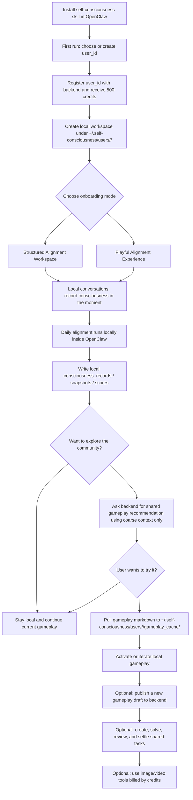
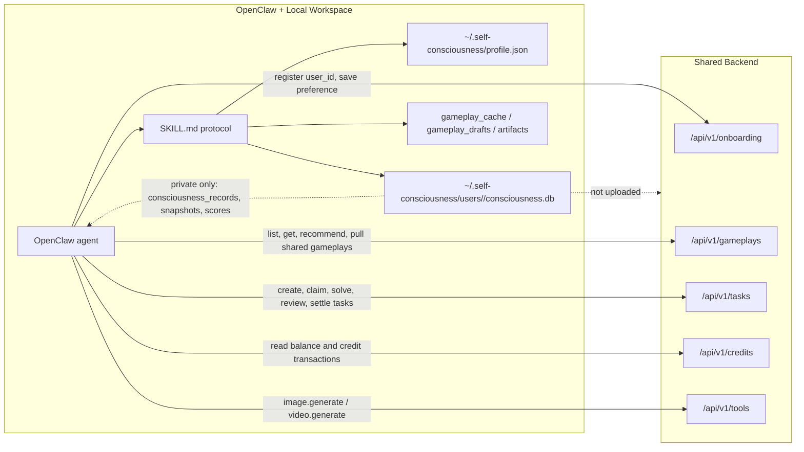

# User Experience

## Overall Flow

## Backend Communication

## Privacy Boundary

- Local only: daily alignment, raw consciousness records, snapshots, private scores, local visualization.
- Shared backend: onboarding, shared gameplay discovery, gameplay publish, tasks, credits, media tool jobs.
- Cloud recommendation uses only coarse context such as onboarding mode, preferred gameplay ids, desired tags, current gameplay id, excluded ids, available tools, and stage band.
